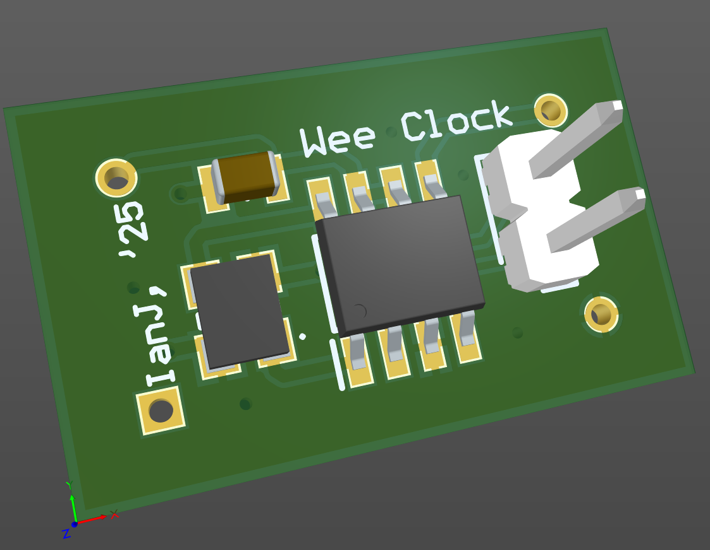

# Controllable clock

May 2025

This is my implementation of an original idea by Steve Harrison - an ICD2053 clock generator - up to 100MHz, primarily for use with Acorn Archimedes Arm3+ machines that utilise a free-running high frequency clock.   This was successfully included in my ARM3+FPA board, and this project just separates it out for use with other boards in place of the standard oscillator - exactly as per Steve's hand-made prototype.

The control signals are a proprietary arrangement for the ICD2053 and can be controlled via the Archimedes IOC using Steve's software.

## Licence

No warranty is provided, and this work is used at your own risk.  

Licenced as CC BY-SA 4.0

Copyright 2025 Ian Jeffray

